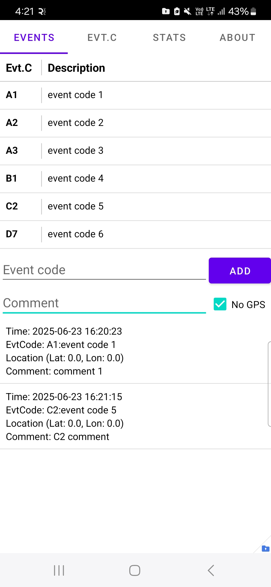

# evtlogger

**evtlogger** is a lightweight Android application for logging and analyzing time-based events.  
Originally designed for sensitive event tracking (such as gang stalking documentation or irregular medical incidents), it is also suitable for general-purpose event collection with customizable categories.

## ✨ Features

- 📝 Log events with:
  - Timestamp
  - Event code (selectable or manually entered)
  - Optional GPS location
  - Free-text notes
- 📊 View statistics by event type (bar chart)
- 🔍 Search and sort events by code or description
- 🔁 Import/export event codes (`evtcode.json`) and events (`events.json`) in JSON format
- 🧠 Autocomplete support for frequently used codes
- 🌐 UTF-8 encoding for internationalization (e.g., Chinese characters)
- 🧩 Offline and privacy-friendly — no internet access required

## 📂 Data Format

### `events.json`
Each event entry:
```json
{
  "timestamp": "2025-06-23T10:00:00Z",
  "code": "PAT_FALL:2ndFloor",
  "latitude": 40.1785,
  "longitude": 44.5126,
  "note": "Patient slipped near bathroom"
}
## 📷 Screenshots

**Main Event Logging Page**  


**Event Code Management**  


**Statistics View**  
